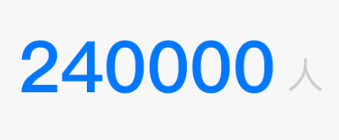
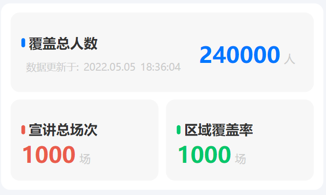

# 组件文档

## Logo 组件 (Logo)


### Props

| 字段名称 | 类型    | 默认值    | 是否必填 | 注释         |
| -------- | ------- | --------- | -------- | ------------ |
| imgUrl   | String  | undefined | false    | 头像图片地址 |
| size     | Number  | 80        | false    | 头像尺寸     |
| round    | Boolean | false     | false    | 是否是圆形   |
| border   | Boolean | false     | false    | 是否显示边框 |

<br>

## 卡片组件(Card)


### Props

| 字段名称 | 类型    | 默认值 | 是否必填 | 注释     |
| -------- | ------- | ------ | -------- | -------- |
| radius   | Number  | 20     | false    | 圆角角度 |
| active   | boolean | false  | false    | 选中状态 |

<br>

## 手机校验输入框 (InputTel)


### Props

| 字段名称    | 类型   | 默认值 | 是否必填 | 注释                                      |
| ----------- | ------ | ------ | -------- | ----------------------------------------- |
| type        | String | ""     | false    | 输入框类型                                |
| label       | String | ""     | false    | 输入框左侧文本 (只有在通用类型下生效)     |
| placeholder | String | ""     | false    | 输入框占位提示文字 (只有在通用类型下生效) |

### Type

| 类型       | 描述                             |
| ---------- | -------------------------------- |
| ''         | 普通类型                         |
| tel        | 电话输入框, 包含国际区域编码选择 |
| validation | 验证码输入框, 包含发送验证码     |

### Event

| 事件名称 | 事件描述         | 返回值             | 返回值类型 |
| -------- | ---------------- | ------------------ | ---------- |
| submit   | 将数据给与父组件 | 要给予父组件的数据 | any        |

<br>

## 链接 (Link)


### Props

| 字段名称 | 类型   | 默认值    | 是否必填 | 注释           |
| -------- | ------ | --------- | -------- | -------------- |
| linkUrl  | String | undefined | true     | 跳转的链接地址 |

<br/>

<br/>

<br>

## 步骤条 (Steps)


### Props

| 字段名称   | 类型   | 默认值                         | 是否必填 | 注释     |
| ---------- | ------ | ------------------------------ | -------- | -------- |
| list       | Array  | ["第一步", "第二步", "第三步"] | false    | 步骤列表 |
| activeStep | Number | 0                              | false    | 初始步骤 |

### Event

父级通过 ref 方式调用

| 事件名称 | 事件描述 | 返回值       | 返回值类型 |
| -------- | -------- | ------------ | ---------- |
| next     | 下一步   | 返回当前步骤 | Number     |
| previous | 上一步   | 返回当前步骤 | Number     |

<br>

## 头像上传 (AvatarUpload)


### Props

| 字段名称 | 类型    | 默认值 | 是否必填 | 注释               |
| -------- | ------- | ------ | -------- | ------------------ |
| multiple | Boolean | false  | false    | 是否支持多文件上传 |

### Event

| 事件名称 | 事件描述     | 返回值       | 返回值类型 |
| -------- | ------------ | ------------ | ---------- |
| change   | 更改图片地址 | 新的图片地址 | String     |

<br>

## 表单项样式组件 (CardForm)


<br>

## 头像 (Avatar)


### Props

| 字段名称 | 类型   | 默认值 | 是否必填 | 注释         |
| -------- | ------ | ------ | -------- | ------------ |
| imgUrl   | String |        | true     | 头像图片地址 |
| width    | Number | 100    | false    | 头像宽度     |
| height   | Number | 135    | false    | 头像高度     |
| radius   | Number | 16     | false    | 圆角角度     |

<br>

## 用户信息列表-行组件 (UserInfoRow)


### Props

| 字段名称  | 类型   | 默认值 | 是否必填 | 注释             |
| --------- | ------ | ------ | -------- | ---------------- |
| imgUrl    | String | ""     | false    | 用户头像图片地址 |
| userName  | String | ""     | false    | 用户名称         |
| userPhone | String | ""     | false    | 用户手机号       |

<br>

## 图表卡片 (ChartCard)


### Props

| 字段名称  | 类型    | 默认值     | 是否必填 | 注释             |
| --------- | ------- | ---------- | -------- | ---------------- |
| iconColor | String  | "#0077ff"  | false    | 标题 icon 的颜色 |
| title     | String  | "标题"     | false    | 标题             |
| showTime  | Boolean | true       | false    | 是否显示时间     |
| time      | Date    | new Date() | false    | 数据更新时间     |

<br>

## 带 icon 的标题 (IconTitle)


### Props

| 字段名称  | 类型   | 默认值    | 是否必填 | 注释             |
| --------- | ------ | --------- | -------- | ---------------- |
| iconColor | String | "#0077ff" | false    | 标题 icon 的颜色 |
| title     | String | "标题"    | false    | 标题             |

<br>

## 数据更新时间 (TimeUpdate)


### Props

| 字段名称 | 类型 | 默认值     | 是否必填 | 注释         |
| -------- | ---- | ---------- | -------- | ------------ |
| time     | Date | new Date() | false    | 数据更新时间 |

<br>

## 数量显示带单位 (NumUnit)



### Props

| 字段名称 | 类型   | 默认值    | 是否必填 | 注释         |
| -------- | ------ | --------- | -------- | ------------ |
| color    | String | "#0077ff" | false    | 数量文本色值 |
| text     | String | "0"       | false    | 数量文本     |
| unit     | String | "单位"    | false    | 单位文本     |

<br>

## 带数字序号的标签页选择器 (TabsNum)


### Props

| 字段名称 | 类型            | 默认值 | 是否必填 | 注释                                                                                        |
| -------- | --------------- | ------ | -------- | ------------------------------------------------------------------------------------------- |
| list     | [Array, Number] |        | true     | Tabs 选项列表数据,<br> 传字符串数组显示带 label 的选择器,<br> 传数字显示不带 label 的选择器 |

### Event

| 事件名称 | 事件描述                 | 返回值             | 返回值类型 |
| -------- | ------------------------ | ------------------ | ---------- |
| change   | 选中的 Tabs 发生改变触发 | 修改当前选中的 tab | Number     |

<br>

## 排行榜列表 (TopList)


### Props

| 字段名称  | 类型            | 默认值 | 是否必填 | 注释           |
| --------- | --------------- | ------ | -------- | -------------- |
| title     | String          | "标题" | false    | 标题           |
| list      | [Array, Object] |        | true     | 排行榜列表数据 |
| showSort  | Boolean         | true   | false    | 是否显示排序   |
| showTitle | Boolean         | true   | false    | 是否显示标题   |

### 数据示例

```js
      [
        {
          label: "福州市台江区上海街道",
          value: "4000人",
        },
        {
          label: "福州市台江区上海街道",
          value: "99人",
        },
        {
          label: "福州市台江区上海街道",
          value: "3000人",
        },
        {
          label: "福州市台江区上海街道",
          value: "1200人",
        },
      ],
```

<br>

## 查看详情按钮 (CheckDetailsBtn)


### Props

| 字段名称 | 类型   | 默认值     | 是否必填 | 注释 |
| -------- | ------ | ---------- | -------- | ---- |
| label    | String | "查看详情" | false    | 标题 |

### Event

| 事件名称 | 事件描述             | 返回值 | 返回值类型 |
| -------- | -------------------- | ------ | ---------- |
| click    | 查看详情按钮点击事件 |        |            |

## 柱状图表列 (ColumnChart)


### Props

| 字段名称  | 类型            | 默认值 | 是否必填 | 注释           |
| --------- | --------------- | ------ | -------- | -------------- |
| title     | String          | "标题" | false    | 标题           |
| list      | [Array, Object] |        | true     | 柱状图列表数据 |
| showTitle | Boolean         | true   | false    | 是否显示标题   |

### 数据示例:

```js

      [
        {
          label: "2/23",
          num: 4000,
        },
        {
          label: "2/23",
          num: 99,
        },
        {
          label: "2/23",
          num: 3000,
        },
        {
          label: "2/23",
          num: 1200,
        },
      ],

```

<br>

## 表格列表排行榜 (TableList)


### Props

| 字段名称   | 类型            | 默认值 | 是否必填 | 注释                        |
| ---------- | --------------- | ------ | -------- | --------------------------- |
| title      | String          | "标题" | false    | 标题                        |
| columns    | [Array, Object] |        | true     | 列表数据标题以及数据 Key 值 |
| list       | [Array, Object] |        | true     | 排行榜列表数据              |
| showHeader | Boolean         | true   | false    | 是否显示表头                |
| showSort   | Boolean         | true   | false    | 是否显示排序                |
| showTitle  | Boolean         | true   | false    | 是否显示标题                |

### 数据示例

#### column 示例

```javascript
      [
        {
          label: "姓名",
          keyName: "name",
        },
        {
          label: "听课人数",
          keyName: "num",
        },
        {
          label: "场次",
          keyName: "round",
        },
      ],
```

#### list 示例

```javascript
      [
        { name: "林老师", num: "200人", round: "100场" },
        { name: "林老师", num: "200人", round: "100场" },
        { name: "林老师", num: "200人", round: "100场" },
        { name: "林老师", num: "200人", round: "100场" },
        { name: "林老师", num: "200人", round: "100场" },
        { name: "林老师", num: "200人", round: "100场" },
        { name: "林老师", num: "200人", round: "100场" },
      ],
```

<br>

## 标签 (Tag)


### Props

| 字段名称 | 类型    | 默认值 | 是否必填 | 注释             |
| -------- | ------- | ------ | -------- | ---------------- |
| title    | String  |        | true     | 标题             |
| close    | Boolean | false  | false    | 是否显示关闭按钮 |
| bigSize  | Boolean | false  | false    | 大号按钮尺寸     |
| active   | Boolean | false  | false    | 是否选中         |

<br>

## 暂无记录 (NoRecord)


<br>

## 标签管理选择器 (MultiSelector)


<br>

## 活动时间选择器 (ChoiceActivityTime)


<br>

## 时长选择器 (HowLongSelector)


<br>

## 地点选择器 (VenueSelector)


<br>

## 数据面板 (DataBoardCard)


